# Website Structure & Navigation Report

> Complete map of all pages, routes, and connections in **my_site** (Next.js + Supabase)

---

## Project Overview

| Property  | Value                                     |
| --------- | ----------------------------------------- |
| Framework | Next.js (App Router)                      |
| Auth      | Supabase (Google OAuth, PKCE flow)        |
| Database  | Supabase (tables: `profiles`, `students`) |
| Styling   | Tailwind CSS                              |
| Font      | Inter (Google Fonts)                      |

---

## All Routes

| Route                | File                                                                                       | Type             | Auth Required | Navbar Shown |
| -------------------- | ------------------------------------------------------------------------------------------ | ---------------- | ------------- | ------------ |
| `/`                  | [page.tsx](file:///d:/1.Antigravity%20Projects/my_site/src/app/page.tsx)                   | Page (public)    | ❌             | ✅            |
| `/login`             | [page.tsx](file:///d:/1.Antigravity%20Projects/my_site/src/app/login/page.tsx)             | Page (public)    | ❌             | ✅            |
| `/auth/callback`     | [route.ts](file:///d:/1.Antigravity%20Projects/my_site/src/app/auth/callback/route.ts)     | API Route        | ❌ (system)    | N/A          |
| `/onboarding`        | [page.tsx](file:///d:/1.Antigravity%20Projects/my_site/src/app/onboarding/page.tsx)        | Page (protected) | ✅             | ✅            |
| `/student/dashboard` | [page.tsx](file:///d:/1.Antigravity%20Projects/my_site/src/app/student/dashboard/page.tsx) | Page (protected) | ✅             | ✅            |
| `/admin/dashboard`   | [page.tsx](file:///d:/1.Antigravity%20Projects/my_site/src/app/admin/dashboard/page.tsx)   | Page (protected) | ✅             | ✅            |
| `/physics`           | [page.tsx](file:///d:/1.Antigravity%20Projects/my_site/src/app/physics/page.tsx)           | Page (protected) | ✅             | ❌            |

---

## Complete Navigation Flow Diagram

```mermaid
flowchart TD
    subgraph PUBLIC["🌐 Public Zone"]
        HOME["/ (Home Page)\nHero · About · Classes · Contact"]
        LOGIN["/login\nGoogle Sign-In Button"]
    end

    subgraph AUTH_SYSTEM["🔐 Auth System (Server-Side)"]
        GOOGLE["Google OAuth\n(External)"]
        CALLBACK["/auth/callback\nExchange code → session\nCheck profiles table"]
    end

    subgraph PROTECTED["🔒 Protected Zone"]
        ONBOARDING["/onboarding\nComplete Profile Form\n(name, WhatsApp, batch)"]
        STUDENT["/student/dashboard\nStudent Dashboard"]
        ADMIN["/admin/dashboard\nAdmin Dashboard"]
    end

    subgraph PHYSICS_HUB["⚛️ The Axiom (Physics Hub) — Protected"]
        PHYSICS["/physics\nDashboard · Students\nMarking · Analytics"]
    end

    %% Physics Hub auth guard
    PHYSICS -->|"No auth session"| LOGIN

    %% Navbar links
    HOME -->|"Navbar: 'The Axiom' button"| LOGIN
    HOME -->|"Navbar: Home / About / Classes / Contact"| HOME

    %% Login flow
    LOGIN -->|"Click 'Sign in with Google'"| GOOGLE
    GOOGLE -->|"OAuth redirect"| CALLBACK

    %% Auth callback routing (role-based)
    CALLBACK -->|"No profile found"| ONBOARDING
    CALLBACK -->|"role = 'student'"| STUDENT
    CALLBACK -->|"role = 'admin'"| ADMIN
    CALLBACK -->|"Error"| LOGIN

    %% Onboarding routing
    ONBOARDING -->|"No auth session"| LOGIN
    ONBOARDING -->|"Profile exists (admin)"| ADMIN
    ONBOARDING -->|"Profile exists (student)"| STUDENT
    ONBOARDING -->|"Form submitted → role='student'"| STUDENT

    %% Logout flows
    STUDENT -->|"Log Out button"| LOGIN
    ADMIN -->|"Log Out button"| LOGIN

    %% Physics Hub
    PHYSICS -->|"Sidebar: '← Back to Portfolio'"| HOME

    style PUBLIC fill:#1a3a5c,stroke:#3b82f6,color:#fff
    style AUTH_SYSTEM fill:#4a2040,stroke:#a855f7,color:#fff
    style PROTECTED fill:#1a4a2a,stroke:#22c55e,color:#fff
    style PHYSICS_HUB fill:#4a3a1a,stroke:#f59e0b,color:#fff
```

---

## Detailed Page-by-Page Connections

### 1. Home Page (`/`)

The landing page — the entry point for all visitors.

**Sections:** Hero → About → Classes → Footer/Contact

| Link                     | Target                                | Type                             |
| ------------------------ | ------------------------------------- | -------------------------------- |
| "View Classes"           | `#classes`                            | Anchor scroll                    |
| "My Engineering Profile" | `#about`                              | Anchor scroll                    |
| Navbar: "Home"           | `/`                                   | Page link                        |
| Navbar: "About"          | `#about`                              | Anchor scroll                    |
| Navbar: "Classes"        | `#classes`                            | Anchor scroll                    |
| Navbar: "Contact"        | `#contact`                            | Anchor scroll                    |
| Navbar: "The Axiom" ⚛️    | `/login`                              | Page link                        |
| Footer: LinkedIn         | `linkedin.com/in/sandun-preamakumara` | External link (opens in new tab) |
| Footer: Email            | `mailto:contact@sandun.eng`           | Email                            |

---

### 2. Login Page (`/login`)

Google OAuth sign-in page using Supabase PKCE flow.

| Action                | Target                              | Condition  |
| --------------------- | ----------------------------------- | ---------- |
| "Sign in with Google" | Google OAuth → `/auth/callback`     | Always     |
| Error display         | Shows `?error=` param from callback | On failure |

---

### 3. Auth Callback (`/auth/callback`)

Server-side API route — processes the OAuth response and routes users based on their profile.

---

### 4. Onboarding Page (`/onboarding`)

Profile completion form for first-time users. Has its own auth guard logic.

| Condition                      | Action                                                                    |
| ------------------------------ | ------------------------------------------------------------------------- |
| No authenticated user          | Redirect → `/login`                                                       |
| Profile exists, role = `admin` | Redirect → `/admin/dashboard`                                             |
| Profile exists, role = other   | Redirect → `/student/dashboard`                                           |
| No profile (first visit)       | Show form (name, WhatsApp, batch year)                                    |
| Form submitted successfully    | Inserts profile with `role: "student"` → redirect to `/student/dashboard` |

---

### 5. Student Dashboard (`/student/dashboard`)

Simple dashboard placeholder for authenticated students. **Protected by `useAuthGuard({ requiredRole: "student" })`.**

| Condition / Action   | Target                                        |
| -------------------- | --------------------------------------------- |
| No auth session      | Redirect → `/login`                           |
| User role is `admin` | Redirect → `/admin/dashboard`                 |
| "Log Out" button     | Signs out via Supabase → redirect to `/login` |

---

### 6. Admin Dashboard (`/admin/dashboard`)

Simple dashboard placeholder for authenticated admins. **Protected by `useAuthGuard({ requiredRole: "admin" })`.**

| Condition / Action     | Target                                        |
| ---------------------- | --------------------------------------------- |
| No auth session        | Redirect → `/login`                           |
| User role is `student` | Redirect → `/student/dashboard`               |
| "Log Out" button       | Signs out via Supabase → redirect to `/login` |

---

### 7. Physics Hub / "The Axiom" (`/physics`)

A standalone dashboard app with its own sidebar navigation. **Protected by `useAuthGuard()`** (any authenticated user). **The main Navbar is hidden** on this route (controlled by [LayoutChrome](file:///d:/1.Antigravity%20Projects/my_site/src/components/LayoutChrome.tsx#7-18)).

**Internal Sections** (client-side tab switching, not separate routes):

| Section          | Description                          | Status      |
| ---------------- | ------------------------------------ | ----------- |
| Dashboard        | Stats cards + quick actions          | Active      |
| Student Database | Table from Supabase `students` table | Active      |
| Paper Marking    | Placeholder                          | Coming Soon |
| Analytics        | Placeholder                          | Coming Soon |

| Link                           | Target     |
| ------------------------------ | ---------- |
| Sidebar: "← Back to Portfolio" | `/` (Home) |

---

## Shared Components

### useAuthGuard ([useAuthGuard.ts](file:///d:/1.Antigravity%20Projects/my_site/src/hooks/useAuthGuard.ts))

- Reusable client-side auth guard hook
- Checks `supabase.auth.getUser()` on mount
- Optionally accepts `requiredRole` (`"admin"` | `"student"`) for role-based access control
- Redirects unauthenticated users → `/login`
- Redirects role-mismatched users → their correct dashboard
- Returns `{ isLoading, userId }` for loading state management
- **Used by:** `/student/dashboard`, `/admin/dashboard`, `/physics`

### Navbar ([Navbar.tsx](file:///d:/1.Antigravity%20Projects/my_site/src/components/Navbar.tsx))

- Fixed top bar with scroll-hide behavior
- Desktop + mobile responsive (hamburger menu)
- Active section tracking via `IntersectionObserver`
- **Shown on all routes EXCEPT `/physics*`**

### LayoutChrome ([LayoutChrome.tsx](file:///d:/1.Antigravity%20Projects/my_site/src/components/LayoutChrome.tsx))

- Wraps all pages in root [layout.tsx](file:///d:/1.Antigravity%20Projects/my_site/src/app/layout.tsx)
- Conditionally renders [Navbar](file:///d:/1.Antigravity%20Projects/my_site/src/components/Navbar.tsx#7-194) based on `pathname`
- Adds `pt-16` padding when Navbar is shown

---

## Auth Flow Summary

---

## Supabase Tables Used

| Table      | Used By                         | Purpose                             |
| ---------- | ------------------------------- | ----------------------------------- |
| `profiles` | `/auth/callback`, `/onboarding` | User profile + role (admin/student) |
| `students` | `/physics`                      | Student records for Physics Hub     |

---

## Key Observations

> [!TIP]
> All protected routes (`/student/dashboard`, `/admin/dashboard`, `/physics`) now have **client-side auth guards** via the shared `useAuthGuard` hook. Unauthenticated users are redirected to `/login`, and role-mismatched users are redirected to their correct dashboard.

> [!NOTE]
> The Navbar "The Axiom" button points to `/login`, not `/physics`. This is intentional — users must authenticate before accessing the Physics Hub. After login, the auth callback routes them to the appropriate dashboard.

> [!NOTE]
> The `/onboarding` page has its own independent auth guard logic (not using the shared hook) that checks for existing profiles and redirects accordingly.
